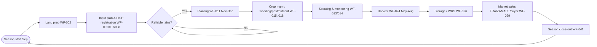
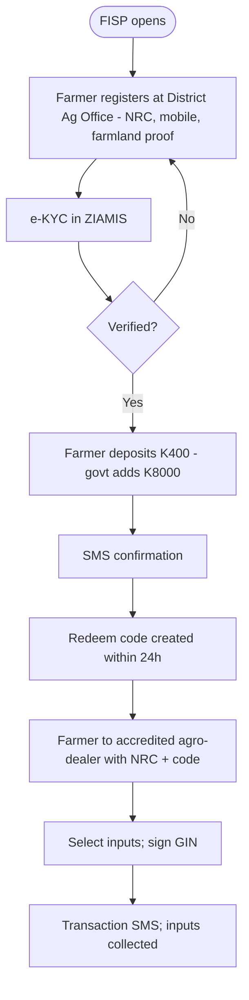
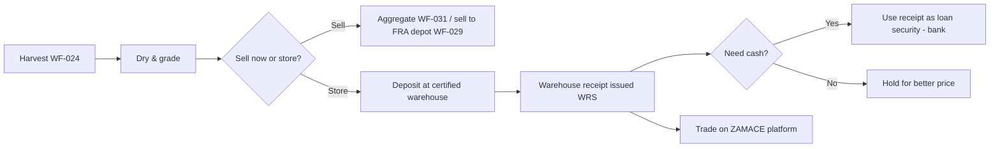
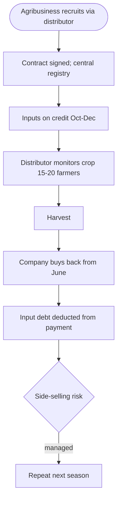
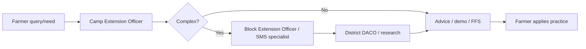

# Operational Process Maps — Zambian Agriculture

> Representative end-to-end maps (BPMN-style, Mermaid). These describe *how work flows*, not software.

## 1. Smallholder season lifecycle

## 2. FISP e-voucher input supply

*(Source: [SRC-0045] MoA; [SRC-0048] PDU.)*

## 3. Harvest-to-market with warehouse receipts

*(Source: [SRC-0051] PARM; [SRC-0052] FRA; [SRC-0053] ZAMACE.)*

## 4. Contract farming / outgrower cycle

*(Source: [SRC-0054] J-PAL; [SRC-0055] World Bank.)*

## 5. Extension advisory flow

*(Structure per [SRC-0050] MEAS; [SRC-0049] NAESP.)*

## Note
Maps are operational (current-state) descriptions. No future/target software design is implied.
