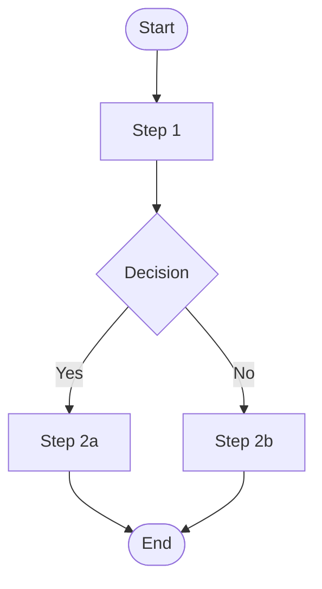

# Process Map — <WF-ID> (BPMN)

| Field | Value |
|-------|-------|
| Process | |
| Related workflow | WF- |
| Notation | BPMN 2.0 |

## Diagram

## Swimlanes / roles
## Data objects (ENT-) at each step
## Systems touched (current vs proposed)
## Bottlenecks (cited)
## Evidence
- [SRC-…]
